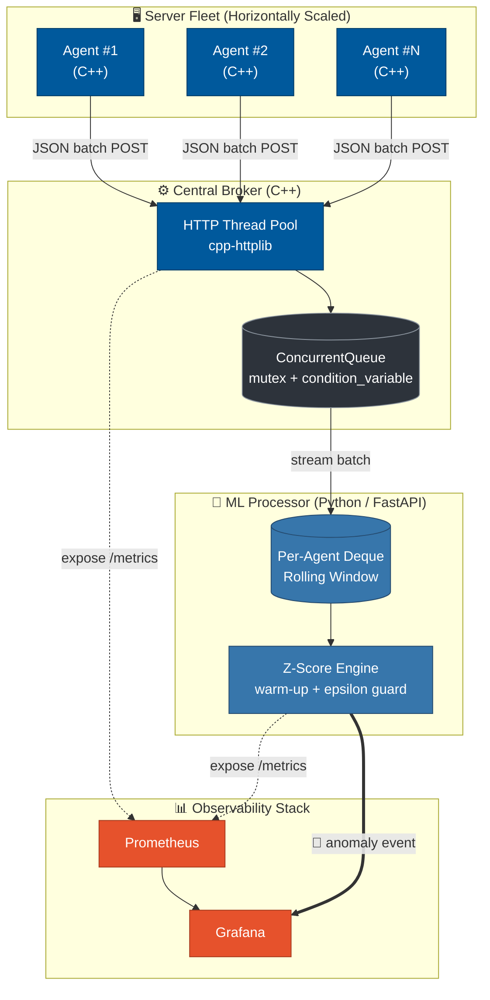
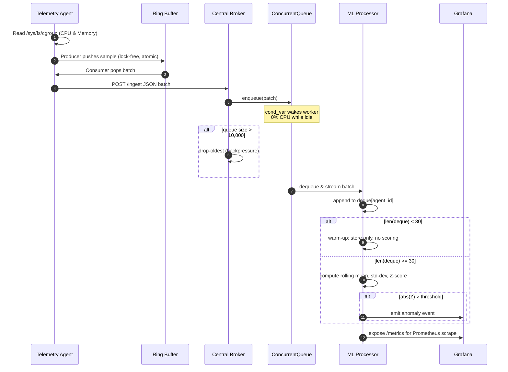
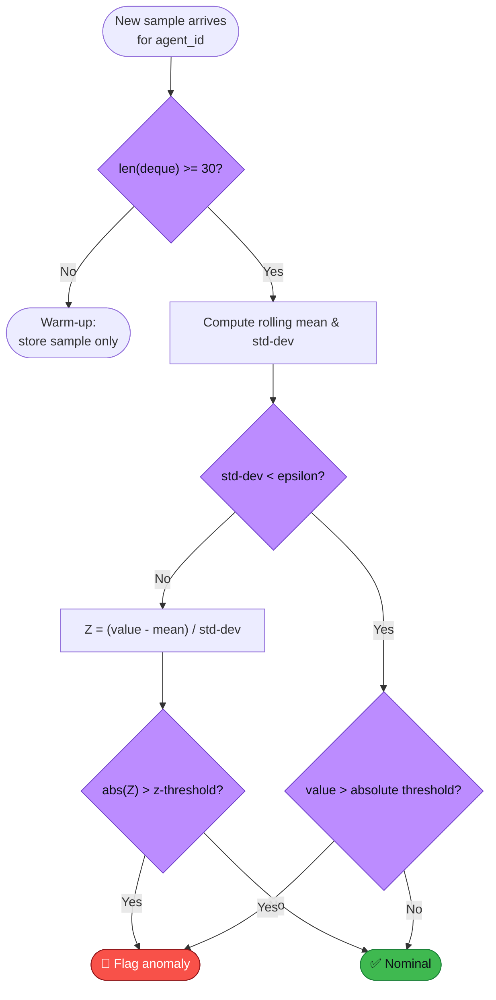

<div align="center">

# 💓 SystemPulse

### High-Throughput Telemetry Streaming & Real-Time Anomaly Detection Pipeline

*A distributed, lock-free, self-healing observability system — built in modern C++ and Python.*

[](#)
[](#)
[](#)
[](#)
[](#)
[](#)
[](#)

</div>

## 📑 Table of Contents

- [Overview](#overview)
- [Design Goals](#Design-Goals)
- [Key Features](#key-features)
- [System Architecture](#system-architecture)
- [End-to-End Data Flow](#end-to-end-data-flow)
- [Component Deep Dive](#component-deep-dive)
- [Engineering Challenges & Solutions](#engineering-challenges--solutions)
- [Performance Benchmarks](#performance-benchmarks)
- [Chaos Engineering & Fault Injection](#chaos-engineering--fault-injection)
- [Demo & Dashboards](#Demo)
- [Tech Stack](#tech-stack)
- [Getting Started](#getting-started)
- [Project Structure](#project-structure)
- [Testing](#testing)
- [Contributing](#contributing)
- [Author](#author)

---
## 📖 Overview

**SystemPulse** is a distributed telemetry pipeline for collecting infrastructure metrics and detecting anomalies in real time.

The system consists of lightweight C++ agents that continuously collect container-scoped CPU and memory metrics, a high-throughput C++ broker that aggregates telemetry from a fleet of machines, and a Python-based anomaly detection service that performs rolling statistical analysis on each host independently. Every component exports Prometheus metrics, enabling complete end-to-end observability through Grafana.

Unlike traditional monitoring stacks that rely on general-purpose collectors, SystemPulse implements its own ingestion pipeline from the ground up—including a custom lock-free ring buffer, a condition-variable-driven concurrent queue, bounded backpressure handling, and an online rolling Z-score engine. The objective is to explore how a modern telemetry system can remain efficient, fault-tolerant, and horizontally scalable while maintaining minimal runtime overhead.

The project demonstrates concepts commonly found in production distributed systems:

- High-throughput telemetry ingestion
- Lock-free concurrent programming
- Producer–consumer architectures
- Backpressure and load shedding
- Online statistical anomaly detection
- Horizontal scaling with container orchestration
- End-to-end observability using Prometheus and Grafana
---
## 🎯 Design Goals

SystemPulse was built to investigate several engineering problems commonly encountered in distributed observability systems:

- **Low-overhead telemetry collection** using lightweight native C++ agents
- **Efficient concurrent ingestion** without busy-waiting or excessive synchronization
- **Resilience under downstream congestion** through bounded queues and backpressure
- **Online anomaly detection** without requiring historical datasets or offline training
- **Horizontal scalability** where hundreds of agents can be added with minimal operational effort
- **Full observability** of the monitoring pipeline itself using Prometheus and Grafana

---

## ✨ Key Features

- 🔩 **Custom Lock-Free Ring Buffer** — atomic producer-consumer communication inside each agent for near-zero CPU overhead.
- 🌐 **Horizontally Scalable by Design** — agents self-assign identity via `gethostname()`; scale from 1 to 100+ replicas with one command.
- 🧵 **Zero Busy-Waiting** — the broker's queue blocks on a `condition_variable`, idling at 0.0% CPU instead of spinning.
- 🛡️ **Backpressure-Aware** — a strict drop-oldest policy at 10,000 items protects the broker from OOM crashes during downstream congestion.
- 📈 **Online Anomaly Detection** — per-host rolling Z-score scoring with warm-up periods, epsilon safeguards, and absolute-threshold fallbacks.
- 🐳 **Container-Native Metrics** — reads `cgroups`, not `/proc`, so every container reports genuinely isolated CPU/memory usage.
- 🔭 **Full Observability Loop** — native Prometheus `/metrics` endpoints in both C++ and Python, visualized on a Grafana dashboard.
- 🔥 **Battle-Tested with Chaos Engineering** — `stress-ng`-driven fault injection validates the anomaly detector under real load.

---

## 🏗️ System Architecture

SystemPulse is composed of four cooperating layers, each independently scalable and independently observable: a fleet of lightweight C++ agents, a central C++ broker, a Python ML scoring service, and an observability stack that watches the whole pipeline — including itself.



- **Agents → Broker**: agents batch samples and ship them over HTTP as JSON; the broker never blocks a producer, it only accepts and enqueues.
- **Broker → ML Processor**: the broker's internal `ConcurrentQueue` is drained by the ML service, which maintains a bounded rolling window per `agent_id`.
- **Every layer → Observability**: both the C++ services and the Python service expose native `/metrics` endpoints, scraped by Prometheus and visualized in Grafana — the pipeline monitors itself with the same rigor it applies to the fleet.

---

## 🔄 End-to-End Data Flow

The sequence below traces a single telemetry sample from the moment it's read off a container's `cgroup` file to the moment it either lands safely in a dashboard or trips an anomaly alert.



---

## 🧠 Component Deep Dive

### 1. Telemetry Agent — C++

Each agent is a small, self-contained binary designed to be invisible to the workload it's monitoring. Internally it runs a classic **producer-consumer** pattern across two threads:

- A **sampling thread** (producer) polls the container's `cgroup` files for CPU and memory usage at a fixed interval.
- A **network thread** (consumer) drains the samples and ships them to the broker as batched JSON over HTTP.

The two threads never touch a mutex to hand off data. Instead they communicate through a **custom lock-free atomic ring buffer**, so the producer can keep sampling even while the network thread is busy flushing a batch, and vice versa — no blocking, no lock contention, no busy-waiting. On startup, each agent calls POSIX `gethostname()` to derive its own unique `agent_id`, which is what makes horizontal scaling trivial: there's no central registry to coordinate, because Docker already guarantees every scaled replica a unique hostname.

### 2. Central Broker — C++

The broker is the fan-in point for the entire fleet. It exposes an HTTP ingestion endpoint (via `cpp-httplib`) backed by a thread pool, so N agents can POST batches concurrently without serializing on a single accept loop. Once a batch is accepted, it's handed to a custom `ConcurrentQueue` — a `std::mutex` + `std::condition_variable`-backed structure that eliminates busy-waiting entirely (see [Engineering Challenges](#engineering-challenges--solutions)).

Because the broker sits between a fleet that can burst unpredictably and a downstream ML service that processes at its own pace, it also enforces a strict **backpressure policy**: once the queue hits 10,000 items, it starts dropping the *oldest* entries rather than growing without bound. In distributed-systems terms, this is a deliberate load-shedding decision — under sustained congestion, the broker chooses to stay alive and keep serving recent data over faithfully queuing everything and risking an OOM crash that takes the whole pipeline down.

### 3. ML Processor — Python / FastAPI

The ML processor is where raw numbers become a judgment call: *is this normal, or not?* For every `agent_id`, it maintains an isolated `collections.deque` — a fixed-size rolling window of recent samples — and computes a live **Z-score** for each new value against that window's mean and standard deviation.

Three guardrails keep this from being a naive, false-positive-prone implementation:

1. A **30-sample warm-up period** before any score is computed at all (the Cold Start fix).
2. An **epsilon safeguard** that catches near-zero standard deviation — a metric that's been essentially flat — before it can blow up a division.
3. An **absolute-threshold fallback** for exactly that flat-metric case, so a genuinely large jump in an otherwise-quiet metric still gets caught even when the Z-score math alone isn't reliable.



### 4. Observability Stack

Both the C++ services and the Python service expose their own `/metrics` endpoint in Prometheus exposition format — the pipeline is instrumented with the same seriousness as the systems it watches. The Grafana dashboard built on top tracks, at minimum:

- **Ingestion Rate** — batches/sec arriving at the broker
- **Queue Saturation %** — how close the `ConcurrentQueue` is to its 10,000-item backpressure ceiling
- **Dropped Packets** — a direct visualization of load-shedding in action
- **Fleet-wide Anomalies** — every flagged `agent_id`, plotted over time

---

## 🛠️ Engineering Challenges & Solutions

| # | Challenge | One-Line Fix |
|---|---|---|
| 1 | The Shared Kernel Illusion | Read `cgroups`, not `/proc/stat`, for true per-container isolation |
| 2 | The Cold Start Bug | 30-sample warm-up before any Z-score is computed |
| 3 | Busy-Waiting | `condition_variable::wait()` — 0.0% CPU at idle |
| 4 | Auto-Scaling Orchestration | Self-assigned `agent_id` via `gethostname()` + `--scale agent=N` |

### 1. The Shared Kernel Illusion

**The problem:** Inside a container, reading `/proc/stat` doesn't give you what you'd expect. Depending on the runtime and kernel configuration, that file can reflect the *host's* aggregate CPU state rather than a view scoped to the individual container — so ten containers on the same host could all report identical, host-wide numbers instead of their own actual usage. For a project whose entire premise is per-host anomaly detection, that's not a minor bug, it's a silent correctness failure.

**The fix:** The agent reads directly from the container's `cgroup` pseudo-filesystem (`/sys/fs/cgroup/`), which the container runtime *does* scope per-container. This was verified empirically: with 100 containers running simultaneously, each one reports independent, isolated CPU and memory figures.

### 2. The Cold Start Bug

**The problem:** A newly spawned agent has no history. Computing a standard deviation — and therefore a Z-score — from one or two samples isn't just statistically weak, it's actively dangerous: a single early reading can produce an enormous, meaningless Z-score and fire a false anomaly before the system has any real baseline to compare against.

**The fix:** Every `agent_id` gets a mandatory 30-sample warm-up window. Samples are stored in the rolling deque during this period but are never scored — the anomaly detector stays silent until it actually has a statistically meaningful baseline to judge against.

### 3. Busy-Waiting

**The problem:** The most naive way to build a producer-consumer queue is to have the consumer poll in a loop — "is there work yet? is there work yet?" That pattern pins a CPU core near 100% even when the entire pipeline is sitting completely idle, which is a poor look for a system explicitly designed to prove low overhead.

**The fix:** The broker's `ConcurrentQueue` puts consumer threads to sleep on a `std::condition_variable` and only wakes them when a producer calls `notify()`. Measured idle CPU usage: 0.0%.

### 4. Auto-Scaling Orchestration

**The problem:** Simulating a real fleet by hand-declaring 100 separate `agent` blocks in `docker-compose.yml` — or worse, spinning up 100 containers manually — doesn't scale as an engineering practice, and it doesn't reflect how real infrastructure is actually managed.

**The fix:** A single parameterized `agent` service definition, combined with each container self-registering its own `agent_id` via POSIX `gethostname()` (Docker assigns every scaled replica a unique hostname automatically), means the entire fleet can grow or shrink with one command — `docker compose up --scale agent=100` — with zero code or config changes.

---

## 📊 Performance Benchmarks

Measured during a local stress test with 100 concurrently Dockerized agents(servers):

| Metric | Result |
|---|---|
| Concurrent Agents | 100 Dockerized agents |
| Sustained Throughput | ~6,000 metrics/min (99.8 batches/sec) |
| Per-Agent CPU Footprint | ~0.7% CPU |
| Per-Agent Memory Footprint | ~1.7 MB RAM |
| Backpressure Resilience | 7,231 packets safely dropped during a simulated network outage — broker memory stayed capped, zero OOM crashes |
| Broker Idle CPU | 0.0% (condition-variable blocking, zero busy-wait) |

---

## 🔥 Chaos Engineering & Fault Injection

Correctness claims about an anomaly detector are only as good as the chaos you throw at it. SystemPulse ships with a `trigger_anomaly.sh` script that dynamically targets a specific agent replica inside the scaled fleet and injects real CPU load using `stress-ng`:

```bash
# Target agent replica #14 out of a 100-agent fleet and spike its CPU
docker compose exec --index=14 agent stress-ng --cpu 4
```

This isn't a synthetic unit test with mocked inputs — it's a real container, under real load, inside the actual running pipeline, and the ML Processor has to catch the resulting spike using nothing but the live metrics stream.

---

## 📸 Demo

**Grafana — Dashboard Overview**
---

---

**Anomaly Detection in Action**
---

---

**Chaos Test — Backpressure Under Load**
---

---


---

## 🧰 Tech Stack

| Layer | Technology | Purpose |
|---|---|---|
| Agent & Broker | C++20 | Low-level, high-performance metric collection & ingestion |
| Networking | `cpp-httplib` | Lightweight embedded HTTP server/client for the C++ services |
| Concurrency | `std::mutex`, `std::condition_variable`, atomics | Thread-safe concurrency without busy-waiting |
| Testing | GoogleTest (`gtest`) | C++ unit testing |
| ML Service | Python 3 + FastAPI | Async anomaly-detection microservice |
| ML / Stats | NumPy | Rolling statistics & anomaly scoring |
| Containerization | Docker, Docker Compose | Isolation, orchestration, horizontal scaling |
| Metrics | Prometheus | Time-series metrics collection & exposition |
| Visualization | Grafana | Real-time SRE dashboards |
| OS Internals | Linux `cgroups`, POSIX `gethostname()` | Container-scoped resource introspection & self-identification |
| Chaos Testing | `stress-ng` | Synthetic load & fault injection |

---

## 🚀 Getting Started

### Prerequisites
- Docker & Docker Compose (v2+)
- *(Optional, for local dev outside containers)* CMake, a C++17/20-compliant compiler, Python 3.10+

### Clone & Run
```bash
git clone https://github.com/akshatddyl/SystemPulse.git
cd SystemPulse
docker compose up --build
```

### Scale the Fleet
```bash
docker compose up --scale agent=100 -d
```

### Access the Dashboards
| Service | Default URL |
|---|---|
| Grafana | http://localhost:3000 (username & password: `admin`) |
| Prometheus | http://localhost:9090 |
| ML Processor (FastAPI docs) | http://localhost:8000/docs |

### Trigger a Chaos Test
```bash
docker compose exec --index=14 agent stress-ng --cpu 4
```

---

## 📂 Project Structure

```
├── agent/
│   ├── CMakeLists.txt
│   ├── Dockerfile
│   ├── main.cpp
│   ├── metrics_collector.hpp
│   └── ring_buffer.hpp
├── broker/
│   ├── CMakeLists.txt
│   ├── concurrent_queue.hpp
│   ├── Dockerfile
│   └── main.cpp
├── grafana/
│   ├── dashboards/
│   │   └── telemetry.json
│   └── provisioning/
│       ├── dashboards/
│       │   └── dashboards.yml
│       └── datasources/
│           └── datasource.yml
├── ml-processor/
│   ├── app.py
│   ├── Dockerfile
│   └── requirements.txt
├── prometheus/
│   └── prometheus.yml
├── .gitignore
├── docker-compose.yml
├── start.md
└── trigger_anomaly.sh

```

---
## 🧪 Testing

SystemPulse utilizes **Google Test (gtest)** to validate C++ unit logic, specifically targeting the custom lock-free concurrency structures (Ring Buffer) to mathematically prove thread safety and boundary resilience under stress.

Tests are executed using CMake's standard `ctest` utility via a clean, out-of-source build.

```bash
# 1. Navigate to the target directory
cd agent

# 2. Generate the out-of-source build files
cmake -B build -DCMAKE_BUILD_TYPE=Debug

# 3. Compile the test executable
cmake --build build

# 4. Run the test suite
ctest --test-dir build --output-on-failure
```
---

## 🤝 Contributing

This started as a solo portfolio build, but issues, ideas, and pull requests are welcome. Feel free to open an issue to discuss a change before submitting a PR.

---

## 👤 Author

Built and maintained by **[@akshatddyl](https://github.com/akshatddyl)**.

Feel free to reach out via GitHub with questions, feedback, or future implementations.

---

<div align="center">

**If SystemPulse's approach to distributed observability interests you, consider ⭐ starring the repo.**

</div>
